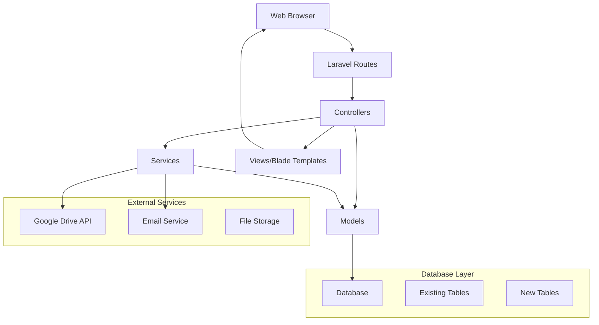

# Design Document

## Overview

The Project Close-Out System will be built as an extension to the existing Laravel-based Woodnork Green project management application. The system will automatically generate Project Close-Out Reports by aggregating data from the existing phase-based workflow that tracks projects from enquiry through completion.

Rather than manual data entry, the system will intelligently pull information from existing models like `Project`, `ProjectPhase`, `Enquiry`, `MaterialList`, `Production`, `HandoverReport`, `SetupReport`, and related entities that are populated throughout the project lifecycle. The final phase will trigger the automatic generation of a comprehensive closeout report.

The solution leverages the existing Laravel 12 framework with phase-based project tracking, automatically compiling data from each completed phase into the standardized Project Close-Out Report format required by Woodnork Green.

## Architecture

### System Architecture
The system follows Laravel's MVC architecture pattern with the following key components:



### Technology Stack
- **Backend**: Laravel 12 with PHP 8.2+
- **Frontend**: Blade templates with Tailwind CSS and Alpine.js
- **Database**: MySQL/PostgreSQL (existing database)
- **File Storage**: Google Drive API integration
- **Email**: Laravel Mail with configured SMTP
- **Authentication**: Laravel Breeze (existing)
- **Authorization**: Spatie Laravel Permission (existing)
- **PDF Generation**: DomPDF (existing dependency)
- **Excel Export**: Maatwebsite Excel (existing dependency)

### Phase Integration Workflow
The system integrates with the existing phase-based project workflow:

```mermaid
graph LR
    A[Enquiry Phase] --> B[Site Survey Phase]
    B --> C[Design Phase]
    C --> D[Budget & Quotation Phase]
    D --> E[Material Procurement Phase]
    E --> F[Production Phase]
    F --> G[Setup Phase]
    G --> H[Handover Phase]
    H --> I[Set-Down Phase]
    I --> J[Auto-Generate Closeout Report]
    J --> K[Submit for Approval]
    K --> L[Email to Projects Dept]
```



**Automatic Trigger**: When the final project phase (Set-Down) is marked as completed, the system automatically:
1. Generates a closeout report by aggregating data from all completed phases
2. Collects relevant attachments from each phase
3. Sends notification to Project Officer for review
4. Triggers the 48-hour submission deadline countdown

## Components and Interfaces

### 1. Models

#### ProjectCloseoutReport Model
```php
class ProjectCloseoutReport extends Model
{
    protected $fillable = [
        'project_id', 'generated_at', 'status', 'submitted_at', 'approved_at',
        'approved_by', 'supervisor_comments', 'manual_adjustments'
    ];
    
    // Relationships with existing models
    public function project() { return $this->belongsTo(Project::class); }
    public function approvedBy() { return $this->belongsTo(User::class, 'approved_by'); }
    public function attachments() { return $this->hasMany(CloseoutAttachment::class); }
    
    // Data aggregation methods that pull from existing phase data
    public function getProjectInfoAttribute() {
        return [
            'title' => $this->project->name,
            'client_name' => $this->project->client_name,
            'project_code' => $this->project->project_id,
            'project_officer' => $this->project->projectOfficer->name,
            'site_location' => $this->project->venue,
            'start_date' => $this->project->start_date,
            'end_date' => $this->project->end_date,
        ];
    }
    
    public function getProcurementDataAttribute() {
        $materialLists = $this->project->materialLists;
        $production = $this->project->production;
        
        return [
            'materials_requested' => $materialLists->pluck('items')->flatten(),
            'production_start_date' => $production?->created_at,
            'procurement_challenges' => $this->extractChallengesFromPhases('procurement'),
        ];
    }
    
    public function getSetupDataAttribute() {
        $setupReports = $this->project->setupReports;
        return [
            'setup_dates' => $setupReports->pluck('created_at'),
            'team_composition' => $this->extractTeamFromBookingOrders(),
            'site_challenges' => $this->extractChallengesFromPhases('setup'),
        ];
    }
    
    public function getHandoverDataAttribute() {
        $handoverReports = $this->project->handoverReports;
        return [
            'handover_date' => $handoverReports->first()?->acknowledgment_date,
            'client_feedback' => $handoverReports->first()?->client_comments,
            'client_signoff_status' => $handoverReports->isNotEmpty() ? 'completed' : 'pending',
        ];
    }
    
    private function extractChallengesFromPhases(string $phaseType) {
        return $this->project->phases()
            ->where('name', 'like', "%{$phaseType}%")
            ->whereNotNull('notes')
            ->pluck('notes')
            ->implode('; ');
    }
    
    private function extractTeamFromBookingOrders() {
        return $this->project->bookingOrders()
            ->with('teams.user')
            ->get()
            ->pluck('teams')
            ->flatten()
            ->pluck('user.name')
            ->unique()
            ->values();
    }
}
```

#### CloseoutAttachment Model
```php
class CloseoutAttachment extends Model
{
    protected $fillable = [
        'closeout_report_id', 'attachment_type', 'file_name',
        'file_path', 'google_drive_id', 'file_size', 'uploaded_by'
    ];
    
    public function closeoutReport() { return $this->belongsTo(ProjectCloseoutReport::class); }
    public function uploadedBy() { return $this->belongsTo(User::class, 'uploaded_by'); }
}
```

### 2. Controllers

#### ProjectCloseoutController
- `index()` - List all closeout reports with filtering and pagination
- `generate(Project $project)` - Automatically generate closeout report from completed phases
- `show()` - Display auto-generated closeout report with all aggregated data
- `edit()` - Show form for manual adjustments to auto-generated report
- `update()` - Save manual adjustments to auto-generated report
- `submit()` - Submit report for approval (triggered when final phase completes)
- `approve()` - Supervisor approval action
- `destroy()` - Delete closeout report (with proper authorization)
- `export()` - Export report as PDF with all phase data compiled

#### Enhanced Controllers for Delete Functionality
- **SiteSurveyController**: Add `destroy()` method for deleting site surveys
- **EnquiryLogController**: Add `destroy()` method for deleting enquiry logs

#### CloseoutAttachmentController
- `store()` - Upload and store attachments
- `destroy()` - Delete attachments
- `download()` - Download attachments from Google Drive

### 3. Services

#### CloseoutReportService
```php
class CloseoutReportService
{
    public function generateReportFromPhases(Project $project): ProjectCloseoutReport
    {
        // Automatically generate report by aggregating data from all completed phases
        $report = ProjectCloseoutReport::create([
            'project_id' => $project->id,
            'generated_at' => now(),
            'status' => 'draft'
        ]);
        
        // Collect attachments from various phases
        $this->collectPhaseAttachments($report, $project);
        
        return $report;
    }
    
    public function updateReport(ProjectCloseoutReport $report, array $manualAdjustments): ProjectCloseoutReport
    public function submitForApproval(ProjectCloseoutReport $report): bool
    public function approveReport(ProjectCloseoutReport $report, User $supervisor): bool
    public function sendNotifications(ProjectCloseoutReport $report, string $type): void
    public function generatePDF(ProjectCloseoutReport $report): string
    
    private function collectPhaseAttachments(ProjectCloseoutReport $report, Project $project): void
    {
        // Collect cutlists from material lists
        foreach ($project->materialLists as $materialList) {
            if ($materialList->cutlist_file) {
                $this->createAttachment($report, 'cutlist', $materialList->cutlist_file);
            }
        }
        
        // Collect deliverables from design assets
        foreach ($project->designAssets as $asset) {
            $this->createAttachment($report, 'deliverables_ppt', $asset->file_path);
        }
        
        // Collect site survey forms
        foreach ($project->siteSurveys as $survey) {
            if ($survey->survey_file) {
                $this->createAttachment($report, 'site_survey', $survey->survey_file);
            }
        }
        
        // Collect budget files
        foreach ($project->budgets as $budget) {
            if ($budget->budget_file) {
                $this->createAttachment($report, 'budget_file', $budget->budget_file);
            }
        }
        
        // Collect setup and handover reports
        foreach ($project->setupReports as $setupReport) {
            $this->createAttachment($report, 'setup_setdown_checklists', $setupReport->google_drive_link);
        }
        
        foreach ($project->handoverReports as $handoverReport) {
            $this->createAttachment($report, 'client_feedback', $handoverReport->google_drive_link);
        }
    }
    
    private function createAttachment(ProjectCloseoutReport $report, string $type, string $filePath): void
    {
        CloseoutAttachment::create([
            'closeout_report_id' => $report->id,
            'attachment_type' => $type,
            'file_path' => $filePath,
            'uploaded_by' => auth()->id()
        ]);
    }
}
```

#### GoogleDriveService
```php
class GoogleDriveService
{
    public function uploadFile(UploadedFile $file, string $folderId): array
    public function createProjectFolder(Project $project): string
    public function downloadFile(string $fileId): StreamedResponse
    public function deleteFile(string $fileId): bool
}
```

#### NotificationService
```php
class NotificationService
{
    public function sendSubmissionNotification(ProjectCloseoutReport $report): void
    public function sendApprovalNotification(ProjectCloseoutReport $report): void
    public function sendReminderNotification(User $user, array $overdueReports): void
    public function sendDeadlineWarning(ProjectCloseoutReport $report): void
}
```

### 4. Frontend Components

#### Form Components (Blade + Alpine.js)
- **ProjectInfoSection**: Basic project information fields
- **ProcurementSection**: Materials and inventory tracking
- **FabricationSection**: Production and QC details
- **SetupSection**: On-site setup information
- **HandoverSection**: Client interaction and sign-off
- **SetDownSection**: Project completion and cleanup
- **AttachmentUploader**: File upload with progress tracking
- **StatusTracker**: Visual progress indicator

#### Dashboard Components
- **ReportsList**: Paginated list with filters and search
- **StatusCards**: Summary cards showing report counts by status
- **DeadlineAlerts**: Notifications for approaching deadlines
- **ApprovalQueue**: Supervisor dashboard for pending approvals

## Data Models

### Database Schema

#### project_closeout_reports Table
```sql
CREATE TABLE project_closeout_reports (
    id BIGINT UNSIGNED PRIMARY KEY AUTO_INCREMENT,
    project_id BIGINT UNSIGNED NOT NULL,
    generated_at TIMESTAMP NOT NULL,
    status ENUM('draft', 'submitted', 'approved', 'rejected') DEFAULT 'draft',
    submitted_at TIMESTAMP NULL,
    approved_at TIMESTAMP NULL,
    approved_by BIGINT UNSIGNED NULL,
    supervisor_comments TEXT,
    manual_adjustments JSON NULL, -- Store any manual overrides to auto-generated data
    created_at TIMESTAMP DEFAULT CURRENT_TIMESTAMP,
    updated_at TIMESTAMP DEFAULT CURRENT_TIMESTAMP ON UPDATE CURRENT_TIMESTAMP,
    deleted_at TIMESTAMP NULL,
    
    FOREIGN KEY (project_id) REFERENCES projects(id) ON DELETE CASCADE,
    FOREIGN KEY (approved_by) REFERENCES users(id),
    INDEX idx_status (status),
    INDEX idx_project_id (project_id),
    INDEX idx_generated_at (generated_at),
    INDEX idx_submitted_at (submitted_at)
);
```

**Note**: This simplified table structure stores only the report metadata and manual adjustments. All other data (project info, procurement details, setup information, etc.) is dynamically retrieved from existing phase-related tables through the model's accessor methods.

#### closeout_attachments Table
```sql
CREATE TABLE closeout_attachments (
    id BIGINT UNSIGNED PRIMARY KEY AUTO_INCREMENT,
    closeout_report_id BIGINT UNSIGNED NOT NULL,
    attachment_type ENUM('cutlist', 'deliverables_ppt', 'site_survey', 'budget_file', 'mrf_material_list', 'qc_checklist', 'setup_setdown_checklists', 'client_feedback') NOT NULL,
    file_name VARCHAR(255) NOT NULL,
    file_path VARCHAR(500),
    google_drive_id VARCHAR(255),
    file_size BIGINT UNSIGNED,
    uploaded_by BIGINT UNSIGNED NOT NULL,
    created_at TIMESTAMP DEFAULT CURRENT_TIMESTAMP,
    updated_at TIMESTAMP DEFAULT CURRENT_TIMESTAMP ON UPDATE CURRENT_TIMESTAMP,
    
    FOREIGN KEY (closeout_report_id) REFERENCES project_closeout_reports(id) ON DELETE CASCADE,
    FOREIGN KEY (uploaded_by) REFERENCES users(id),
    INDEX idx_attachment_type (attachment_type),
    INDEX idx_closeout_report (closeout_report_id)
);
```

### Data Relationships
- `ProjectCloseoutReport` belongs to `Project` (existing)
- `ProjectCloseoutReport` belongs to `User` (approved by supervisor)
- `ProjectCloseoutReport` has many `CloseoutAttachment`
- `CloseoutAttachment` belongs to `ProjectCloseoutReport`
- `CloseoutAttachment` belongs to `User` (uploaded by)

### Phase Data Integration
The closeout report automatically aggregates data from existing phase-related models:
- **Project Information**: From `Project` model (name, client, dates, officer, venue)
- **Procurement Data**: From `MaterialList`, `MaterialListItem`, `Production` models
- **Fabrication Data**: From `Production`, `ProductionItem`, `ProductionParticular` models
- **Setup Data**: From `SetupReport`, `BookingOrder`, `BookingOrderTeam` models
- **Handover Data**: From `HandoverReport` model
- **Site Survey Data**: From `SiteSurvey` model (with delete capability for data management)
- **Enquiry Log Data**: From `EnquiryLog` model (with delete capability for data management)
- **Attachments**: Collected from `DesignAsset`, `SiteSurvey`, `ProjectBudget`, and other file-containing models
- **Team Information**: From `BookingOrderTeam` and related `User` models
- **Timeline Data**: From `ProjectPhase` completion dates and status updates

### Data Management Features
- **Site Survey Management**: Full CRUD operations including delete functionality with proper authorization
- **Enquiry Log Management**: Full CRUD operations including delete functionality with proper authorization
- **Soft Deletes**: Implement soft deletes for site surveys and enquiry logs to maintain data integrity
- **Audit Trail**: Track deletions for compliance and data governance

## Error Handling

### Validation Rules
```php
class StoreCloseoutReportRequest extends FormRequest
{
    public function rules(): array
    {
        return [
            'project_id' => 'required|exists:projects,id',
            'project_title' => 'required|string|max:255',
            'client_name' => 'required|string|max:255',
            'project_officer_id' => 'required|exists:users,id',
            'set_up_date' => 'nullable|date',
            'set_down_date' => 'nullable|date|after_or_equal:set_up_date',
            'handover_date' => 'nullable|date',
            'attachments.*' => 'file|max:10240|mimes:pdf,doc,docx,xls,xlsx,jpg,jpeg,png',
            // Additional validation rules for all fields
        ];
    }
}
```

### Exception Handling
- **File Upload Errors**: Graceful handling of file size limits, invalid formats
- **Google Drive API Errors**: Retry logic with exponential backoff
- **Email Delivery Failures**: Queue-based retry mechanism
- **Database Constraints**: User-friendly error messages
- **Permission Errors**: Proper authorization checks with meaningful responses

### Error Logging
- All errors logged to Laravel's logging system
- Critical errors (file upload failures, API errors) trigger admin notifications
- User actions tracked for audit purposes

## Testing Strategy

### Unit Tests
- **Model Tests**: Relationships, scopes, and business logic
- **Service Tests**: Core business logic and external API interactions
- **Validation Tests**: Form request validation rules
- **Helper Tests**: Utility functions and data transformations

### Feature Tests
- **Authentication**: Login, logout, and permission checks
- **CRUD Operations**: Create, read, update, delete closeout reports
- **File Upload**: Attachment handling and Google Drive integration
- **Email Notifications**: Submission and approval workflows
- **PDF Generation**: Report export functionality

### Integration Tests
- **Google Drive API**: File upload, download, and folder creation
- **Email Service**: SMTP integration and queue processing
- **Database**: Complex queries and data integrity
- **Permission System**: Role-based access control

### Browser Tests (Laravel Dusk)
- **Form Submission**: Complete workflow from creation to approval
- **File Upload**: Drag-and-drop and traditional upload methods
- **Mobile Responsiveness**: Touch interactions and responsive design
- **User Workflows**: End-to-end scenarios for different user roles

### Test Data Management
- **Factories**: Generate realistic test data for all models
- **Seeders**: Consistent test environment setup
- **Database Transactions**: Isolated test execution
- **File Mocking**: Simulate file uploads without actual files

### Performance Testing
- **Load Testing**: Multiple concurrent users creating reports
- **File Upload Performance**: Large file handling and progress tracking
- **Database Performance**: Query optimization and indexing
- **Memory Usage**: Efficient handling of large datasets

### Security Testing
- **Input Validation**: SQL injection and XSS prevention
- **File Upload Security**: Malicious file detection
- **Authorization**: Proper access control enforcement
- **CSRF Protection**: Form submission security
- **Rate Limiting**: API abuse prevention

The testing strategy ensures comprehensive coverage of all functionality while maintaining fast test execution and reliable results. Tests will be integrated into the CI/CD pipeline for automated quality assurance.